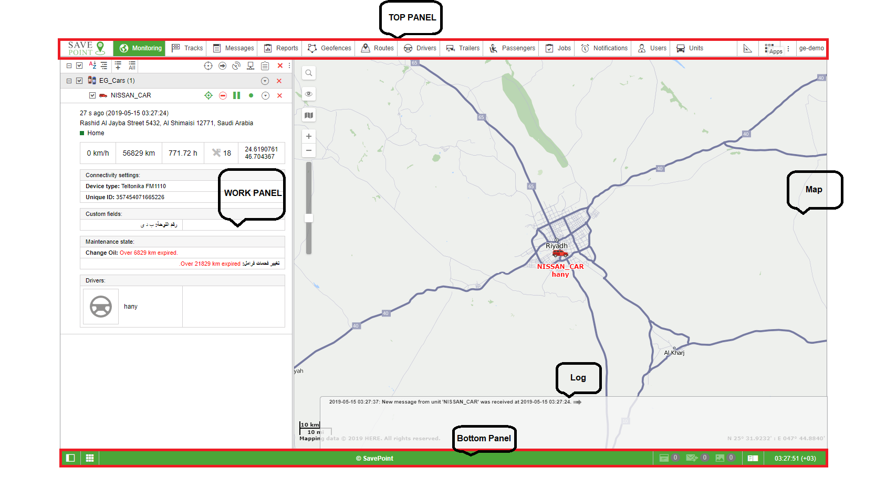

# User Interface

The user interface of SavePoint AVL System is simple and in many cases intuitive. There are plenty of screen tips and helpers associated with various buttons, icons, dialog boxes, edit fields, and other elements of the interface. Moreover, special icons are located in the interface. They are used to deal with the most 'difficult places', as a help text opens when you click on any of them.

Generally, the following basic structural elements can be distinguished in the interface design:

* work area,
* map,
* top panel,
* bottom panel,
* log.

There are also a lot of other different panels and windows which can be activated if necessary.

 _Note._  
To switch to the full-screen mode, press _F11_. This feature is provided by the majority of browsers.

Further information:

* Login
* Top Panel
* Work Area
* Bottom Panel
* Map
* Log
* Shortcuts
* Calendar
* Filters and Masks
* Input Rules

