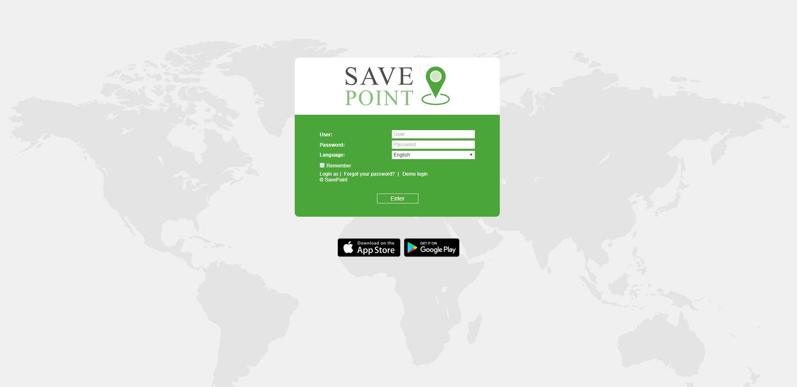
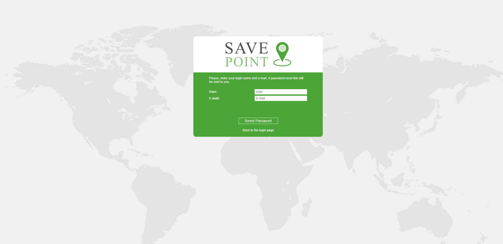

# Login

Enter the service URL into the address line of your browser.

On the login page, enter your **username** and **password**. Note that the characters used in these fields are case sensitive. Afterwards, choose the interface **language**. If you want, you can change it at any time after logging in \(in the user settings\).

After all the necessary fields are indicated, click _Enter_.

If you use a personal computer, you can additionally check the _Remember_ box. In this case, the next time you enter the system you will not be asked to input your login and password again. Moreover, this checkbox is necessary to automatically enter the system in case of losing the session. It should be noted that this option is limited to 30 days. Also, the box becomes unchecked when you exit the system.

For an account with two-factor authentication enabled, in addition to the password, you must enter a verification code, which is sent to the e-mail or via SMS \(the code is valid for 5 minutes\). If the login did not occur and the entered code became red, then it was entered incorrectly. If you enter the wrong code repeatedly, the login will be temporarily blocked.

If the verification code has not been received, click on the _Resend the code_ button \(it becomes active within 30 seconds after the first request\). In case two-factor verification via SMS is used, it is possible to choose how the code must be sent: in an SMS o by e-mail.

 _Note._  
If the current time is displayed in red and in the middle of the screen you can see a warning message \(_Unable to connect to the server. The page will be reloaded automatically when the connection is restored_\), then there is no connection to the server for more than two minutes. This can be caused by the Internet connection failure or some internal system problems. After the connection is restored the message disappears automatically, and the system continues its work. If the connection to the server is lost for 5 minutes and more, the session will be finished. However, when the connection with the server is restored, the user automatically logs in to the login page.

A quick login without entering \(or even knowing\) a user name and password is possible, provided that there is an active session available. Then URL-link should contain the _sid_ parameter, e.g., http://wialonb3.gurtam.com/?**sid=3086417ea744b0dbb85202cebe3ff134**. Note that the input must be from the same IP address. However, be careful giving away such links, as, while the session is active, anyone who has this link can log into the system and perform different actions allowed to that user. To abort the current session, just exit the system \(press _Logout_\).

After the first login into the system, the Data Protection Agreement is shown. In order to proceed, click _I agree_.

### Getting a New Password 

If you have already registered in the system but forgot the password, please, follow the _Forgot your password?_ link. There you will be asked to enter your username and e-mail address. Then press the _Reset password_ button. A link to the page containing your new password will be sent to you. Follow this link to get your new password.

If you have pressed _Forgot your password?_ by accident, just ignore the e-mail with a password reset link and use your previous login and password. If you still follow this link, you will have to use a new password.

### Password Change 

If the _Can change password_ option is activated in the _General_ tab of the user properties, then, according to the security rules, the password change is required at first login. In the opened window, type in the current password, and then enter the new password twice \(the second time in the _Confirm password_ field\).

The current password for the user you logged in as can be changed in the _Security_ tab of the user properties dialog. However, not all users are allowed to do this. Contact your service administrator for more information.

### Login as Another User 

User impersonation allows you to access and operate as if you were logged in as another \(subordinate\) user. To impersonate, you need to have the _Act as given user_ access right towards the user.

If you would like to log in as another user from the authorization page, you need to enter your username and password and then click on the _Login as_ caption and enter the name of the user in the appeared window. When you are logged in as another user, you can see only those items that are available to this user and perform actions allowed to this user. Note that the login history is kept in the account of the user under whose name the system has been entered.

You can switch to another user even after entering the system. However, in this case, the login is _not_ saved in the user's history. To switch it, click the icon  located to the left of the username. Afterwards, the dialog containing two columns \(a username and an account name\) is opened. Users-creators of accounts are marked with the icon  to the left of their names. Click on the name of the required user to authorize in the current tab, or click on the icon at the end of the line to open the page in a new tab. For the search convenience, it is possible to use the dynamic search. The search can be filtered by users or accounts. This is regulated by the filter in the upper left corner of the window.

There is also an alternative way to log in as another user. Go to the Users panel, where each user has a special button for logging in under his name. If you do not have enough access privileges, the button is disabled.

After authorization as another user, the username is written in brackets to the right of the main one \(in the right corner of the Top panel\). To switch back to the main user, click on the icon \(door with arrow\) to the right of the name, and confirm your action by pressing _OK_ in the appeared window.

|  |
| :--- |

