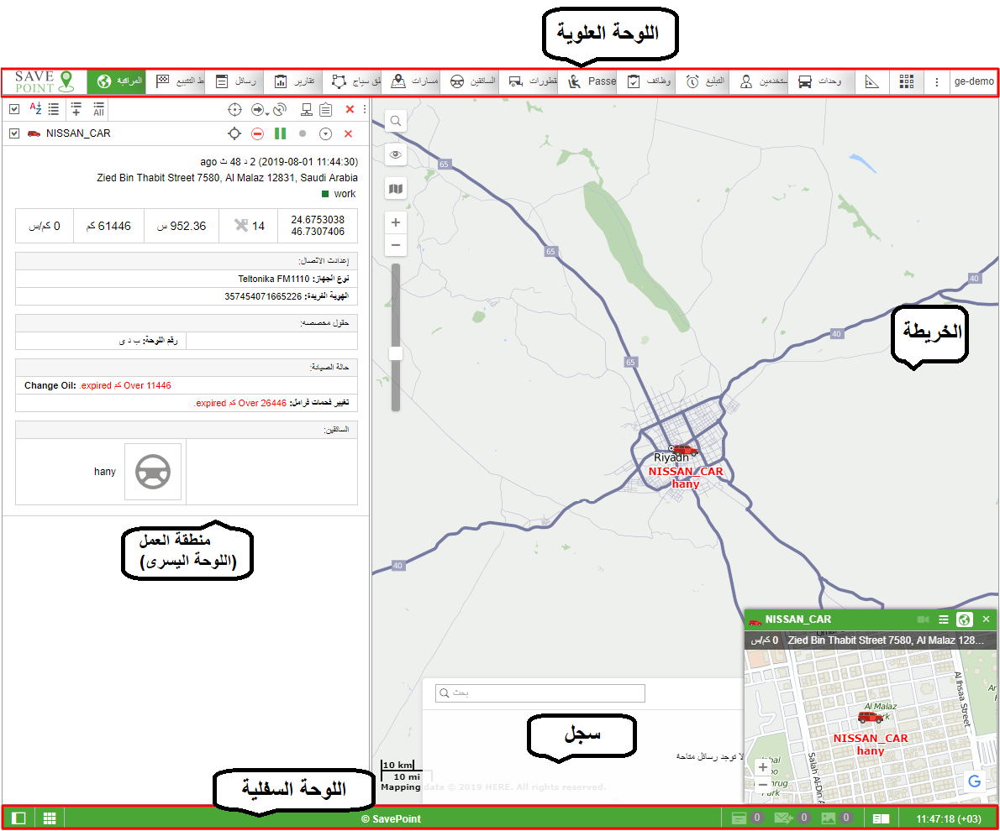

# واجهة المستخدم

## واجهة المستخدم 

واجهة مستخدم SavePoint بسيطة وفي كثير من الحالات بديهية. هناك الكثير من النصائح والمساعدين على الشاشة المرتبطة بالعديد من الأزرار والرموز ومربعات الحوار وحقول التحرير والعناصر الأخرى للواجهة. علاوة على ذلك ، توجد أيقونات خاصة في الواجهة. يتم استخدامها للتعامل مع "الأماكن الأكثر صعوبة" ، حيث يتم فتح نص التعليمات عند النقر فوق أي منها.

بشكل عام ، يمكن تمييز العناصر الهيكلية الأساسية التالية في تصميم الواجهة:  
منطقة العمل  
خريطة  
اللوحة العلوية  
اللوحة السفلية  
سجل   
  
هناك أيضًا الكثير من اللوحات والنوافذ المختلفة التي يمكن تفعيلها إذا لزم الأمر.

 ملحوظة. للتبديل إلى وضع ملء الشاشة ، اضغط F11. يتم توفير هذه الميزة من قبل غالبية المتصفحات.

